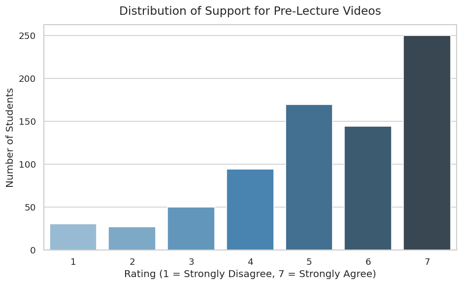
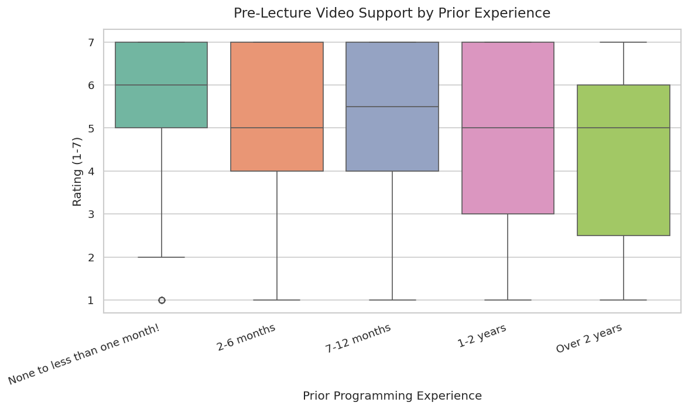
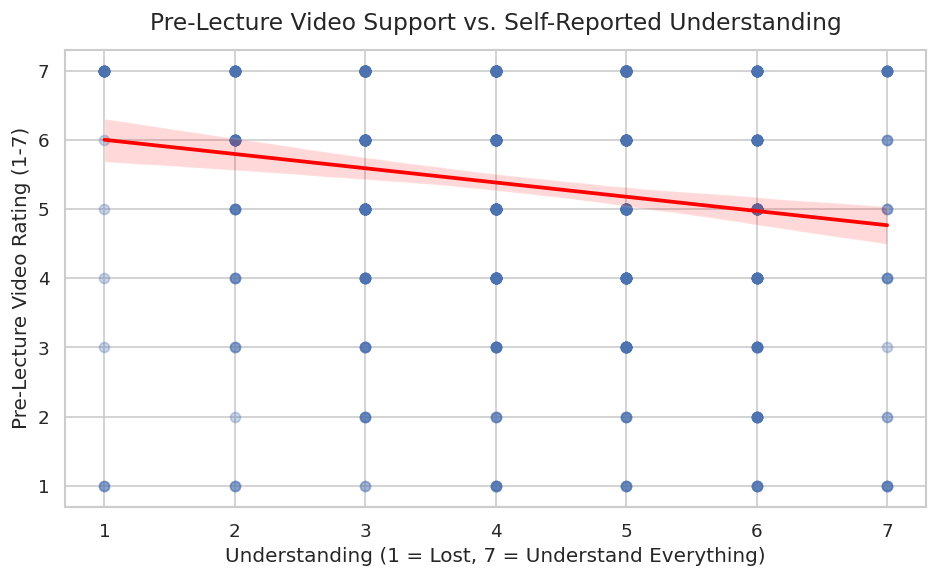
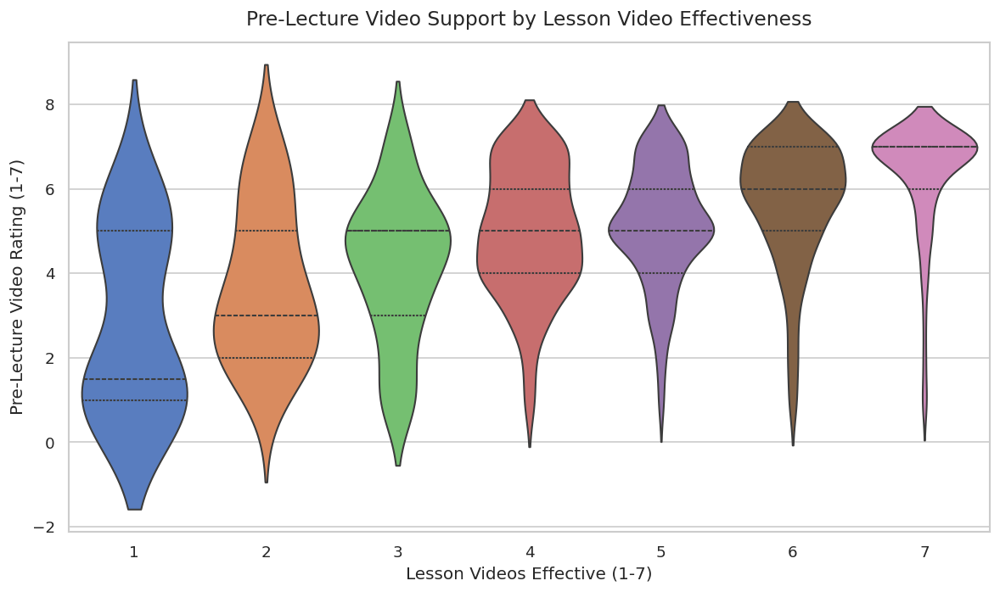

---
# Do not edit the text between these lines!
layout: default
---

**Author:** Advika Arun
**Surbey Responses Analyzed:** 764 total (534 from Dr. Hinks and 230 from Dr. Lytle)

---

## Overview

Like products, courses improve through intentional iteration. In this project, I analyzed anonymized survey data collected from COMP 110 students to explore one idea for improving the course:
> **Adding optional short pre-lecture videos that preview each lecture's content before class**

The survey directly asls students whether they believe prelecture videos would be helpful, and students responded with a rating from 1-7, with one being not helpful at all to 7 being incredibly helpful. I combined both survey datasets, filtered out potentially incomplete responses, and produce four visualizations to explore the student demand.

---

## Five ideas for improving COMP 110

1. The course should offer optional pre-lecture videos so students who prefer to preview material before class arrive better prepared, improving lecture engagement.
2. The course should offer optional extensions on programming exercises for students with prior experience, so advanced students can be more engaged while still keeping the course accessible to beginners.
3. The course should record in person lectures so students who are sick and have to miss class can catch up on everything, and it can also be useful for revision before exams.
4. The course should offer some specific code examples that are somewhat relevant to student majors (like offering datasets on biology stuff for bio students and financial data for business and econ students) to make the course more engaging and relevant to non computer science majors.
5. The course should offer short 'quizzes' (like not the quizzes we take in class but something easier) earlier in the semester to help students self assess understanding before exams, which can reduce exam stress.

---

## Part 1.1 - Identfying Missing Data

1. Idea without sufficient data to analyze: **Major specific examples in class**

2. Suggestion for how to collect data to support this idea in the future: **Add a question in the survey about if students would find the course to be more engaging if programming assignments had examples related to their field of study on a scale. There could also be a follow up open ended question where students could describe what they think a relevant example would look like. The data could be compared to see if there are particular majors who express significant interest in having relevant examples.**

---

## Part 1.2 - Why I chose to analyze pre-lecture videos

1. Idea to analyze with available data: **Pre lecture videos**

2. This idea is more valuable than the others brainstormed because: **This idea has a dedicated question in the surbey, it creates value for the largest stakeholder group (enrolled students), prelecture videos are low cost and scalable compared to the other changes, and if students who are lost or find this course difficult rate this highly, it could benefit those who need the most support.**

---

## Analysis

I loaded both CV diles using 'read_csv_rows', combined them with 'concat', selected relevant columns with 'select', previewed with 'head', filtered empty responses with a custom helper function, converted the ratings to 'int' values with 'convert_columns_to_int', and counted distributions with 'count'.

### Chart 1 - Overall demand for pre-lecture videos

 
The distribution is strongly skewed toward agreement. **73% of students (563 out of 764) rated the idea 5, 6, or 7** — making this one of the clearest signals in the entire survey dataset.

---
 
### Chart 2 — Does Experience Level Change Demand?
 

 
Median support is consistently high (around 5–6) across every experience level — from complete beginners to students with over two years of coding experience. Pre-lecture videos are not just for beginners; they appeal broadly.
 
---
 
### Chart 3 — Does Feeling Lost Drive Demand?
 

 
The regression line is nearly flat with only a slight negative slope. Students who feel lost rate pre-lecture videos only marginally higher than confident students. The feature is valued for **general enrichment**, not just as a rescue tool.
 
---
 
### Chart 4 — Video Learners Want More Video
 

 
Students who rate the existing lesson videos as effective (6–7) show a denser concentration of responses at the top of the pre-lecture scale. If a student engages well with video as a medium, they actively want more of it.
 
---

